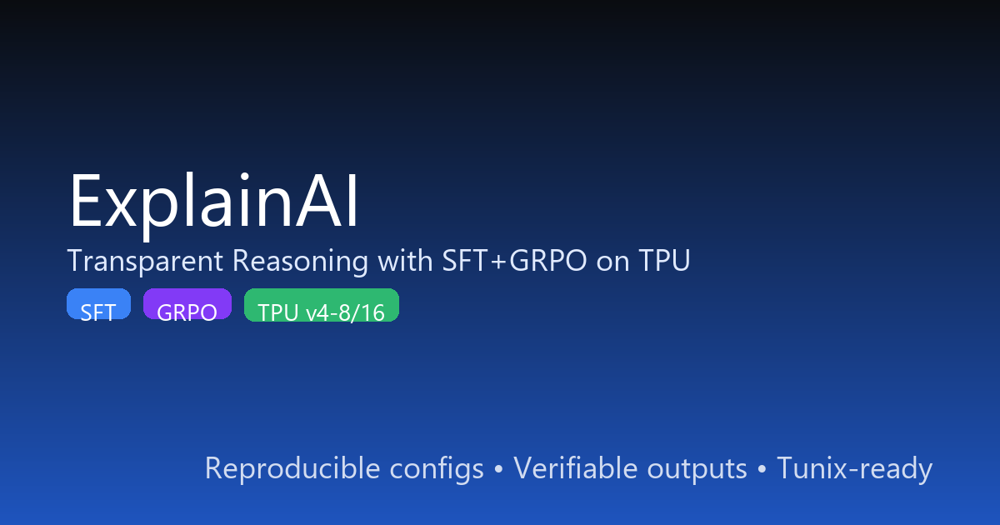

# ExplainAI: Transparent Reasoning with SFT+GRPO on TPU



This repo implements a reproducible reasoning pipeline that fine-tunes Gemma models with Tunix on TPU, blending supervised fine-tuning (SFT) and reward-driven optimization (GRPO). It emphasizes transparent, structured reasoning with clear evaluation and inference entry points.

What you get:
- Configs and recipes for SFT and GRPO post-training with Tunix
- A modular reward function composition for reasoning correctness and formatting
- Data preprocessing for GSM8K-style math reasoning (can be adapted to other tasks)
- Evaluation and inference scripts that render reasoning traces and answers
- A public-notebook template and a Kaggle writeup template

Submission-ready assets:
- Social card: `assets/explainai_card.png` (1200×630)
- Thumbnail: `assets/explainai_thumbnail.png` (512×512)

References:
- Tunix: JAX-native LLM post-training library (GRPO, PPO, GSPO, SFT) — https://github.com/google/tunix and blog overview — https://developers.googleblog.com/en/introducing-tunix-a-jax-native-library-for-llm-post-training/
- Gemma: Open-weight models by Google, available on Hugging Face

## Quick Start

1) Provision a GCP TPU VM (v4-8 or above recommended)
- Image: TPU VM with JAX. Follow Tunix docs for environment setup.
- Optional: Configure SSH port-forwarding for Jupyter.

2) Install dependencies on the TPU VM

```bash
python -m venv .venv && source .venv/bin/activate
pip install -U pip wheel
# Tunix and core deps (JAX/Flax are preinstalled on most TPU images; pin if needed)
pip install tunix transformers datasets sentencepiece accelerate
# Optional logging
pip install wandb rich
```

3) Authenticate for model weights

```bash
huggingface-cli login
```
Make sure you have access to Gemma weights (e.g., `google/gemma-2-2b-it` or `google/gemma-3-1b`).

4) Prepare data

```bash
# Train-only file
python -m src.tunix_reasoning.data \
  --dataset gsm8k --split train \
  --out data/processed/gsm8k_train.jsonl

# Or produce a validation split alongside train
python -m src.tunix_reasoning.data \
  --dataset gsm8k --split train \
  --out data/processed/gsm8k_train.jsonl \
  --out_val data/processed/gsm8k_val.jsonl \
  --val_frac 0.05 --seed 42
```

5) Run SFT (Supervised Fine-Tuning)

```bash
# v4-8 example (apply TPU override)
python -m src.tunix_reasoning.train_sft \
  --config configs/sft_gemma2_2b.yaml \
  --data data/processed/gsm8k_train.jsonl \
  --override configs/overrides_tpu_v4_8.yaml

# v4-16 example
python -m src.tunix_reasoning.train_sft \
  --config configs/sft_gemma2_2b.yaml \
  --data data/processed/gsm8k_train.jsonl \
  --override configs/overrides_tpu_v4_16.yaml

# Or use pre-merged configs (no --override needed)
python -m src.tunix_reasoning.train_sft \
  --config configs/sft_gemma2_2b_v4_8.yaml \
  --data data/processed/gsm8k_train.jsonl

python -m src.tunix_reasoning.train_sft \
  --config configs/sft_gemma2_2b_v4_16.yaml \
  --data data/processed/gsm8k_train.jsonl
```

6) Run GRPO (Reinforcement Learning with rewards)

```bash
# v4-8 example (apply TPU override)
python -m src.tunix_reasoning.train_grpo \
  --config configs/grpo_gemma2_2b.yaml \
  --init_checkpoint checkpoints/sft_last \
  --data data/processed/gsm8k_train.jsonl \
  --override configs/overrides_tpu_v4_8.yaml

# v4-16 example
python -m src.tunix_reasoning.train_grpo \
  --config configs/grpo_gemma2_2b.yaml \
  --init_checkpoint checkpoints/sft_last \
  --data data/processed/gsm8k_train.jsonl \
  --override configs/overrides_tpu_v4_16.yaml

# Or use pre-merged configs (no --override needed)
python -m src.tunix_reasoning.train_grpo \
  --config configs/grpo_gemma2_2b_v4_8.yaml \
  --init_checkpoint checkpoints/sft_last \
  --data data/processed/gsm8k_train.jsonl

python -m src.tunix_reasoning.train_grpo \
  --config configs/grpo_gemma2_2b_v4_16.yaml \
  --init_checkpoint checkpoints/sft_last \
  --data data/processed/gsm8k_train.jsonl
```

7) Evaluate and run inference

```bash
python -m src.tunix_reasoning.eval \
  --config configs/eval.yaml \
  --checkpoint checkpoints/grpo_best \
  --data data/processed/gsm8k_val.jsonl \
  --wandb  # optional, requires WANDB_PROJECT
python -m src.tunix_reasoning.inference --checkpoint checkpoints/grpo_best --question "If a pen costs $2..."
```

## Reward Composition
We combine multiple signals to encourage correct, clear reasoning:
- Correctness: exact-match or normalized equivalence of the final boxed answer
- Format: presence and ordering of `<reasoning>…</reasoning>` and `<final>…</final>` tags
- Length: penalize overly long or too-short traces (range window)
- Step Consistency: simple heuristics (e.g., concludes after a coherent step)
- Stop Bonus: ends with the stop tag where expected

Weights are configured in YAML; see `configs/grpo_gemma2_2b.yaml`.

## Notebook & Kaggle Writeup
- Public notebook template: `notebooks/tunix_gemma_reasoning_pipeline.ipynb` (ready to adapt for Colab/Kaggle; TPU setup notes included)
- Kaggle writeup template: `Kaggle_Writeup_Template.md`

Notebook default TPU size
- The notebook defaults to TPU v4-8 config presets. To switch to v4-16, either set `TPU_SIZE = "v4-16"` in the first config cell, or set an environment variable before launching Jupyter: `export TPU_SIZE=v4-16` (Linux/macOS) or `$env:TPU_SIZE = "v4-16"` (Windows PowerShell).

### Optional: Weights & Biases Logging
- Set `WANDB_PROJECT=tunix_gemma2b_reasoning` (or your project name)
- The eval script supports `--wandb` to log metrics and a few generations.
- In notebooks or custom scripts, you can use:

```python
from src.tunix_reasoning.wandb_utils import try_init_wandb, log_and_finish
run = try_init_wandb(project="tunix_gemma2b_reasoning", name="trial-01", config={"model":"gemma-2-2b-it"})
# ... training/eval ...
log_and_finish(run, {"exact_match": 0.42}, samples=[{"question":"...","pred_final":"...","gt_final":"..."}])
```

### TPU Size Overrides
Use these to scale the default configs up/down based on your TPU budget:

- v4-8 overrides: `configs/overrides_tpu_v4_8.yaml`
- v4-16 overrides: `configs/overrides_tpu_v4_16.yaml`

Apply overrides by merging them in your notebook or tooling (e.g., load base YAML and update with overrides).

## Notes
- Tunix is JAX/TPU-native and under active development. Check the latest release notes: https://github.com/google/tunix/releases
- For large-scale runs, consider MaxText for model loading/runtime with Tunix integration.

## Quick Demo (CPU-friendly sanity)
If you want to quickly sanity-check evaluation flow without TPU:

```bash
# Ensure dependencies
pip install -r requirements.txt

# Run evaluator help
python -m src.tunix_reasoning.eval --help

# Minimal eval using a tiny tokenizer (pad token handled automatically)
# Adjust paths if needed
python -m src.tunix_reasoning.eval \
  --config configs/eval.yaml \
  --checkpoint checkpoints/grpo/derived_config.json \
  --data data/processed/gsm8k_train.jsonl
```

Note: For GPT-2–style tokenizers that lack a padding token, the evaluator assigns the EOS token for padding and sets `model.config.pad_token_id` accordingly. This enables batched evaluation without errors.

## Submission Checklist
- [x] YAML configs validated for `data`, `output`, `algo`
- [x] Derived runtime configs produced for SFT and GRPO
- [x] CLI entry points respond to `--help` (data, sft, grpo, eval, inference)
- [x] Evaluator hardened for tokenizers without a `pad_token`
- [x] Notebook defaults to TPU v4-8 with a toggle for v4-16
- [x] Assets generated (card and thumbnail) for submission
- [x] Repo cleaned of temp scripts; local env/cache ignored via `.gitignore`

## License
- This repository contains configuration and glue code for reproducible research. Ensure datasets and model weights comply with their respective licenses.# HackthonProject
